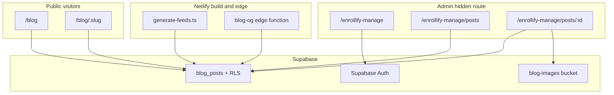
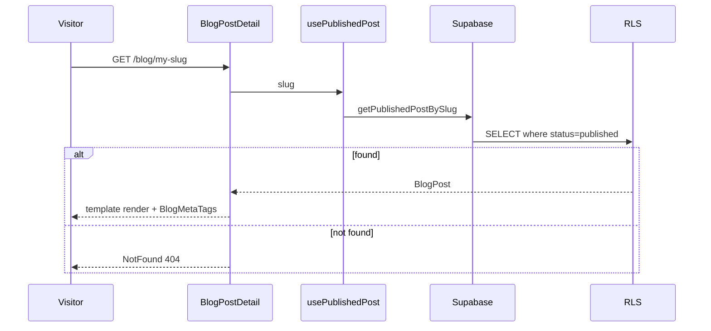

# Product Requirements Document (PRD) — Portable Blog System for Enrollify

## Document control

| Field | Details |
|---|---|
| Product / feature name | Enrollify Blog Module (v1) |
| Document type | Portable PRD — port from PB-Consultant reference implementation |
| Source reference | PB-Consultant `clarity-strategy-blueprint` (as-built Phases 1–5.10) |
| Target | Enrollify landing SPA + hidden admin at `/enrollify-manage` |
| Status | Ready for implementation |
| Version | 1.0 |
| Last updated | 2026-06-27 |
| Explicitly excluded | Visual design, typography, colour tokens, card layouts, and Tailwind styling from PB-Consultant. Enrollify supplies its own design system. |
| Linked artefacts | [phase-1-discovery.md](enrollify/phase-1-discovery.md) through [phase-7-deploy.md](enrollify/phase-7-deploy.md), [pb-consult-blog-prd.md](pb-consult-blog-prd.md) (AC source) |

---

## 1. Overview

### 1.1 Summary

This PRD defines a self-contained blog module for the Enrollify monorepo: an admin-only authoring and publishing workflow plus public blog listing and detail pages. It is ported from a proven implementation on a Vite + React + Supabase SPA and adapted for Enrollify's stack (Vite 6, React 19, React Router 7, Tailwind 4, Supabase, Netlify).

The module lets a site owner create, edit, and manually publish SEO-ready articles without developer involvement. Public visitors browse and read published posts; search engines and social platforms receive correct metadata, RSS, and sitemap entries.

### 1.2 Architecture decision — client-only Supabase for blog

Enrollify has an Express backend (`apps/backend` on Railway) for AI, Messenger, and other server-side concerns. **The blog module does not require the Express backend.**

| Layer | Responsibility |
|---|---|
| Vite SPA (landing + admin) | All blog UI, Supabase client calls with publishable key |
| Supabase Postgres + RLS | Data model, access control |
| Supabase Auth | Admin login; `app_metadata.role = 'admin'` |
| Supabase Storage | Featured and inline images |
| Netlify build scripts | RSS, sitemap, per-slug OG HTML shells |
| Netlify Edge Function | Runtime OG injection for social crawlers |
| Express backend | **Out of scope for blog v1** — no blog routes needed |

Security comes from RLS, not key secrecy. Never expose `SUPABASE_SECRET_KEY` in `VITE_*` variables.



### 1.3 Problem statement

- **Primary user:** Site owner / admin (single-admin model in v1).
- **Secondary users:** Public visitors, search engines, RSS consumers.
- **Gap today:** No in-house blog authoring, draft management, or public article pages.
- **Impact:** Reduced organic visibility, no controlled thought-leadership channel, reliance on external platforms.

### 1.4 Desired outcomes

1. Admin can create, edit, and manually publish SEO-ready posts from a protected area without developer support.
2. Public visitors can browse `/blog` and read individual posts with consistent **functional** structure (not visual styling from source project).
3. Published content is indexable (meta tags, JSON-LD, sitemap, RSS) and shareable (OG/Twitter, LinkedIn/Facebook share URLs).

### 1.5 Success measures

| Measure | Target |
|---|---|
| Time to publish (content ready → live) | Under 15 minutes |
| SEO field completeness on published posts | 100% have unique meta title, meta description, slug, single H1, alt text on non-decorative images |
| Draft leakage | Zero drafts visible via UI, direct URL, API, or RSS |
| Core Web Vitals (listing + detail) | LCP ≤ 2.5s, CLS ≤ 0.1 on typical mobile (Lighthouse) |
| Blog indexed by search engines | Landing page and majority of posts indexed within 30 days of launch |

---

## 2. Users and stakeholders

| User | Need | Priority |
|---|---|---|
| Site owner / admin | Fast authoring, drafts, media, SEO fields, manual publish | High |
| Public visitors | Skimmable articles, filters, related content, CTAs | High |
| Search engines / social crawlers | Clean URLs, meta, structured data, valid RSS/sitemap | High |

**Stakeholders:** Product owner (final sign-off); implementer (executes phased roadmap in [enrollify/](enrollify/) docs).

---

## 3. Scope

### 3.1 In scope (v1)

**Data and backend**
- `blog_posts` table with draft/published lifecycle, SEO metadata, category, optional series/collection, featured image, Quill HTML body, audit timestamps
- Extensions: `article_template`, `related_post_slugs[]`, `is_featured`, `faq_text`
- RLS: public read published only; admin full CRUD via `is_admin()`
- Storage bucket `blog-images` (public bucket, admin write; 2 MB; JPEG/PNG/WebP)

**Admin (`/enrollify-manage`)**
- Supabase Auth email/password login
- Post list with status filter, title search, featured toggle, edit, delete
- Create/edit with Quill editor (H2/H3, bold, italic, lists, blockquote, links, inline images, alignment, allow-listed embeds)
- Featured image upload (requires draft save first for post ID; client-side resize max 1400px width)
- Category combobox (pick existing or create new)
- Admin-curated related posts picker
- Optional FAQ text field
- Article template selector + preview modal (no save required)
- Manual publish with validation gate
- Preview modal renders selected template from current form values

**Public**
- `/blog` listing: cards, category sidebar, featured sidebar (max 5), toolbar (search, sort, series filter)
- URL params: `?category`, `?series`, `?search`, `?sort` (`newest` | `oldest` | `title`)
- Client-side Fuse.js fuzzy search (title, summary, H2–H4 headings)
- `/blog/:slug` detail with template registry (default `classic`), 404 for unknown/unpublished
- Related posts: curated slugs first; else series-first then category (3 slots)
- LinkedIn/Facebook share (URL-based, no blocking third-party scripts)
- Read-time computed at render (~200 WPM, not stored)

**Integrations**
- RSS at `/blog/rss.xml` (summary-only, published only)
- Sitemap includes static routes + `/blog/{slug}` per published post
- Build-time OG HTML shells per slug + Netlify edge function for crawler OG injection
- `react-helmet-async` for runtime meta + JSON-LD (Article, optional FAQPage)
- Optional GA4 and/or Plausible (admin routes excluded from tracking)
- `robots.txt`: disallow `/enrollify-manage`, reference sitemap

### 3.2 Out of scope (v1)

- Scheduled / automated publishing
- Tags (separate from category)
- Dedicated series landing pages
- Multi-author workflows, comments, likes
- Full CMS media library with versioning
- In-admin analytics dashboard
- AI-assisted drafting or SEO scoring (Claude/Perplexity remain separate concerns)
- Full-text RSS
- Direct video/audio file upload (embeds only)
- Express backend blog API routes
- Visual design / styling ported from PB-Consultant
- Deprecated `apps/admin` Next.js app

### 3.3 Configurable project constants

These are **not** hardcoded to PB-Consult values:

| Constant | Enrollify default | Where |
|---|---|---|
| Admin base path | `/enrollify-manage` | Router, robots.txt, analytics exclusion |
| Default author name | Site owner name (env or config) | `author_name` column default |
| Site URL | Production domain | `src/lib/site.ts` |
| Site name | "Enrollify" (or product name) | Meta, RSS, JSON-LD |
| Default OG image | Project fallback image URL | `DEFAULT_OG_IMAGE` |
| End-of-article CTA | Project-specific copy/link | Template block (functional slot, own styling) |

### 3.4 Assumptions

- Single admin user in v1; no multi-author selection UI.
- Publishing is manual; no time-based auto-publish.
- `published_at` (set on publish) is the public display date and default sort key.
- Category and series/collection are separate concepts.
- RSS is summary-only for syndication.
- Listing loads all published posts client-side (no pagination at initial volume).
- Content body is Quill HTML, not Markdown.

---

## 4. User journeys and key scenarios

| Scenario | Trigger | Expected behaviour | Priority |
|---|---|---|---|
| Admin creates draft | Owner prepares new article | Protected create workflow with Quill, metadata, draft save | Must |
| Admin edits post | Owner opens existing post | Load, edit, preserve draft/published state | Must |
| Admin publishes | Owner clicks Publish | Validate, set published + timestamp, expose publicly | Must |
| Visitor browses listing | Navigates to `/blog` | Published cards, filters, search | Must |
| Visitor reads post | Opens `/blog/:slug` | Template layout, body, CTA, share, related | Must |
| Visitor filters | Clicks category/series | Listing updates to matching published posts | Should |
| Visitor follows related | End of post | Related posts (curated or auto) | Should |
| RSS consumer | Requests `/blog/rss.xml` | Valid feed, published only, summary entries | Could |

---

## 5. Technology specification

### 5.1 Enrollify stack mapping

| Component | Enrollify version | Blog role |
|---|---|---|
| Node.js, TypeScript, ESM | Current | Build scripts, edge functions |
| Vite | 6 | SPA build |
| React / React DOM | 19 | UI |
| React Router DOM | 7 | Routes |
| Tailwind CSS | 4 | Enrollify styling only |
| Supabase / PostgreSQL 17 | Current | DB, auth, storage, RLS |
| `@supabase/supabase-js` | Latest | Browser client |
| Express 5 (`apps/backend`) | Current | **Not used for blog** |
| Netlify | Current | Hosting, edge functions |
| npm | Current | Package manager |

**Additional packages to add:**

| Package | Purpose |
|---|---|
| `@tanstack/react-query` | Data fetching hooks |
| `react-quill` / `quill` | Admin editor |
| `dompurify` | HTML sanitization |
| `fuse.js` | Listing search |
| `react-helmet-async` | SEO meta |
| `vitest` + `jsdom` | Unit tests |

### 5.2 Environment variables

```env
# Client-side (browser) — public
VITE_SUPABASE_URL=https://<project-ref>.supabase.co
VITE_SUPABASE_PUBLISHABLE_KEY=sb_publishable_...

# Optional — RLS test script only (never VITE_ prefix)
SUPABASE_TEST_ADMIN_EMAIL=
SUPABASE_TEST_ADMIN_PASSWORD=
```

### 5.3 Database schema

**Migrations** (apply in order via Supabase CLI):

1. `001_blog_posts.sql` — core table, indexes, triggers, RLS, storage bucket
2. `002_blog_posts_article_template.sql`
3. `003_blog_posts_related_post_slugs.sql`
4. `004_blog_posts_is_featured.sql`
5. `005_blog_security_linter_fixes.sql` — **Enrollify blog-only** (see [phase-2-backend.md](enrollify/phase-2-backend.md))
6. `006_blog_posts_faq.sql`

**Final `blog_posts` columns:**

| Column | Type | Notes |
|---|---|---|
| `id` | uuid PK | `gen_random_uuid()` |
| `title` | text NOT NULL | |
| `slug` | text NOT NULL UNIQUE | `^[a-z0-9]+(?:-[a-z0-9]+)*$` |
| `body` | text NOT NULL | Quill HTML |
| `summary` | text | Listing excerpt |
| `status` | text NOT NULL | `'draft'` \| `'published'` (CHECK) |
| `category` | text NOT NULL | Default `''` |
| `series_collection` | text | Optional |
| `featured_image_url` | text | Storage public URL |
| `featured_image_alt` | text | Required at publish if image set |
| `meta_title` | text NOT NULL | |
| `meta_description` | text NOT NULL | |
| `author_name` | text NOT NULL | Configurable default |
| `published_at` | timestamptz | Set on publish |
| `created_at` / `updated_at` | timestamptz | Trigger on update |
| `article_template` | text NOT NULL | Default `'classic'` |
| `related_post_slugs` | text[] NOT NULL | Ordered curated slugs |
| `is_featured` | boolean NOT NULL | Featured sidebar |
| `faq_text` | text | Optional Q&A plain text |

**RLS policies:**
- Public SELECT: `status = 'published'`
- Admin CRUD: `is_admin()` where `(auth.jwt() -> 'app_metadata' ->> 'role') = 'admin'`

**Storage (`blog-images`):** Public bucket; 2 MB; JPEG/PNG/WebP; admin write via `is_admin()`. Paths: `{postId}/...` (featured), `{postId}/inline/...` (body).

### 5.4 Security model (three-pass gate)

1. **Route guard:** `ProtectedRoute` redirects non-admin from `/enrollify-manage/*` (except login)
2. **App layer:** Public queries always `.eq('status', 'published')`; admin checks `app_metadata.role === 'admin'`
3. **RLS:** Postgres enforces even if UI bypassed

### 5.5 Hosting (Netlify)

| Artifact | Mechanism |
|---|---|
| SPA | Vite build → Netlify |
| `/blog/rss.xml` | `scripts/generate-feeds.ts` post-build |
| `/sitemap.xml` | Same script + optionally `@netlify/plugin-sitemap` |
| `/blog/{slug}/index.html` | Build-time OG shell |
| Runtime OG | `netlify/edge-functions/blog-og.ts` |
| Admin privacy | `robots.txt`: `Disallow: /enrollify-manage` |

**Important:** RSS, sitemap, and build-time OG shells refresh on redeploy after new publishes. Runtime edge OG updates without redeploy when post meta changes in Supabase.

---

## 6. Routes and file structure

### 6.1 Routes

| Route | Access | Purpose |
|---|---|---|
| `/blog` | Public | Listing + filters |
| `/blog/:slug` | Public | Post detail (404 if draft/missing) |
| `/blog/rss.xml` | Public | Static RSS |
| `/enrollify-manage` | Public (login) | Admin login |
| `/enrollify-manage/posts` | Admin | Post list |
| `/enrollify-manage/posts/new` | Admin | Create post |
| `/enrollify-manage/posts/:id` | Admin | Edit post |

Blog link in main site navigation → `/blog`. Admin not linked publicly.

### 6.2 Source file map

Port logic from PB-Consultant reference; restyle all UI:

```
supabase/migrations/001–006_blog_*.sql
src/lib/supabase.ts, auth.ts, blog.ts, blog-validation.ts
src/lib/blog-search.ts, blog-og-meta.ts, blog-preview.ts
src/lib/blog-image-html.ts, featured-image-process.ts
src/lib/sanitize.ts, embed-allowlist.ts, feeds.ts, read-time.ts, parse-faq.ts, site.ts
src/types/database.ts
src/contexts/AuthContext.tsx
src/hooks/useBlog.ts
src/components/auth/ProtectedRoute.tsx
src/pages/BlogListing.tsx, BlogPostDetail.tsx
src/pages/admin/AdminLogin.tsx, AdminPostList.tsx, AdminPostEditor.tsx
src/components/admin/BlogPostForm.tsx, AdminLayout.tsx, QuillEditor.tsx
src/components/admin/CategoryCombobox.tsx, RelatedPostsPicker.tsx, ImageInsertDialog.tsx
src/components/admin/quill/BlogImageBlot.ts
src/components/blog/BlogBody.tsx, BlogMetaTags.tsx, BlogListingToolbar.tsx
src/components/blog/BlogCategorySidebar.tsx, BlogFeaturedSidebar.tsx, BlogPostCard.tsx
src/components/blog/RelatedPosts.tsx, ShareButtons.tsx
src/components/blog/templates/registry.ts
src/components/blog/templates/classic/ClassicArticleTemplate.tsx
src/components/blog/article/*
scripts/generate-feeds.ts, verify-rls.ts, verify-feeds.ts, supabase-node-client.ts
netlify/edge-functions/blog-og.ts, netlify.toml
```

---

## 7. Functional requirements and acceptance criteria

All FRs use Given/When/Then. Priorities: Must / Should / Could (MoSCoW).

### FR-1 Blog post data model — Must

**Requirement:** Store each post in `blog_posts` with all columns in Section 5.3.

**Acceptance criteria:**
- Given a new post is created, when the admin saves, then the record persists with unique id, all core fields, and `status = 'draft'`.
- Given a post is retrieved for the public site, when read, then fields required for listing, detail, SEO, and filtering are present.
- Given a post includes a series/collection, when saved, then it is stored in a column distinct from `category`.
- Given a post is saved, when `updated_at` is written on subsequent saves, then `created_at` is never overwritten.

### FR-2 Admin access control — Must

**Acceptance criteria:**
- Given a non-admin or anonymous user, when they request any `/enrollify-manage` blog route except login, then access is denied and they are redirected to login.
- Given an authenticated admin, when they create, edit, publish, or delete, then the action succeeds.
- Given a public query, when made, then only `published` posts are returned.
- Given a write request bypasses the UI, when made by a non-admin via Supabase API, then RLS rejects it.

### FR-3 Create blog post draft — Must

**Acceptance criteria:**
- Given an admin opens create-post, when they enter at least a title and save, then a new post with `status = 'draft'` is created.
- Given a draft is saved, when complete, then it is not visible on public routes or RSS.
- Given title or slug is missing/invalid, when save is attempted, then inline validation blocks save and identifies each field.

### FR-4 Edit existing blog post — Must

**Acceptance criteria:**
- Given an existing post is opened, when the editor loads, then all content and metadata populate the form.
- Given an admin saves a draft, when successful, then status remains `draft` and `updated_at` refreshes.
- Given an admin saves a published post, when successful, then public detail reflects changes on next load and status remains `published`.

### FR-5 Quill editor authoring — Must

**Requirement:** Quill rich-text for body: H2/H3, bold, italic, ordered/unordered lists, blockquote, links, inline images, paragraph alignment, allow-listed embeds.

**Acceptance criteria:**
- Given an admin uses supported formatting, when saved, then formatting persists in stored body.
- Given a saved post is rendered publicly, when detail loads, then structure matches authored content (H2/H3 in body; post title is sole H1).
- Given body contains script tags or event handlers, when saved or rendered, then sanitization removes executable/unsafe content.
- Given inline images are added, when saved, then optional link URL, layout (below/left/right), and alt text are preserved in HTML.

### FR-6 Metadata and SEO fields — Must

**Acceptance criteria:**
- Given publish is attempted, when title, slug, meta_title, meta_description, or category is missing, then publish is blocked with field-level errors.
- Given a non-decorative image exists, when publish is attempted without alt text, then publish is blocked.
- Given a duplicate slug, when save/publish is attempted, then the system rejects and prompts for a unique slug.
- Given a published post, when public page source is inspected, then meta title, description, canonical URL, and Open Graph tags match stored values.

### FR-7 Media support — Must

**Embed allow-list:** YouTube, Vimeo, Spotify, Apple Podcasts, SoundCloud only.

**Acceptance criteria:**
- Given an admin uploads a featured image after draft save, when upload succeeds, then image attaches to post with alt-text field; featured images are resized to max 1400px width before upload.
- Given an allow-listed embed URL, when saved and viewed publicly, then embed renders correctly.
- Given a non-allow-listed embed URL, when added, then the system rejects with an explanatory message.
- Given an image fails to load at view time, when post renders, then page remains usable with alt text or graceful fallback.
- Given an inline image is removed from the editor, when no longer referenced in body HTML, then orphaned storage file under `{postId}/inline/` is deleted.

### FR-8 Manual publish workflow — Must

**Acceptance criteria:**
- Given a draft satisfies FR-6, when admin clicks Publish, then `status = 'published'`.
- Given publish succeeds, then `published_at = now()` and that date displays on the public page.
- Given a post is not published, when a visitor checks listing, `/blog/:slug`, or RSS, then the post is absent.
- Given publish fails, when attempted, then post remains draft and admin sees a clear error.

### FR-9 Blog listing page — Must

**Acceptance criteria:**
- Given published posts exist, when visitor opens `/blog`, then posts list newest first by `published_at` (default sort).
- Given a card renders, then it shows featured image (if present), title, summary, publish date, category, series label (if present), and read-time estimate.
- Given no posts match filter/search, then a clear empty state displays.
- Given only drafts exist, when visitor opens `/blog`, then no drafts appear.

### FR-10 Blog detail page — Must

**Acceptance criteria:**
- Given a published post exists, when visitor opens `/blog/:slug`, then the post renders.
- Given detail loads, then it shows title as single H1, publish date, author, category, series (if present), read-time, sanitized body, end-of-article CTA slot, share actions, and related posts section.
- Given slug matches no published post, then 404/not-found state (not draft content).
- Given post is draft, when slug URL is opened directly, then not-found state.

### FR-10A Article template system — Must

**Requirement:** Reusable template registry; v1 ships one template id `classic`. Section **order** (functional, not visual):

1. Title block
2. Metadata row
3. Featured image (conditional)
4. Article body (+ optional author/FAQ aside slots)
5. End-of-article CTA
6. Share actions
7. Related posts

**Acceptance criteria:**
- Given a published post opens, when detail renders, then the shared template is used (not ad hoc per-post layout).
- Given section order above, when page displays, then blocks appear in that sequence.
- Given featured image exists, when page loads, then image appears in template position with `featured_image_alt` (fallback: post title).
- Given no featured image, when template renders, then layout remains intact without broken spacing.
- Given admin selects article layout, when saved/published, then `article_template` persists.
- Given stored template id is unknown, when detail loads, then `classic` is used as fallback.
- Given admin clicks Preview, when modal opens, then selected template renders current form values without requiring save; preview mode omits go-back, share, and related sections.

### FR-11 Category and series filtering — Should

**Acceptance criteria:**
- Given visitor selects category filter, when listing updates, then only published posts in that category show.
- Given visitor selects series filter, when listing updates, then only matching published posts show.
- Given filters cleared, when listing resets, then all published posts show newest first.
- Given filter matches nothing, then FR-9 empty state applies.

### FR-12 Related posts — Should

**Requirement:** 3 slots. If `related_post_slugs` non-empty, use curated order. Else: same series first, then same category.

**Acceptance criteria:**
- Given curated slugs are set, when related posts generate, then those published posts appear in configured order (excluding current).
- Given no curation and post has series, when generated, then same-series posts fill slots first.
- Given remaining slots, when filled, then same-category published posts used (excluding current and already selected).
- Given widget renders, then current post and drafts are excluded.
- Given no related posts found, then section hides gracefully without breaking page.

### FR-13 Social sharing — Should

**Acceptance criteria:**
- Given visitor uses share action, when opened, then target is canonical `/blog/:slug` URL.
- Given OG metadata configured, when link previewed on LinkedIn/Facebook, then title, description, and image are available (via edge function + build shells for crawlers).
- Given share buttons render, then they do not block render or require failing third-party scripts.

### FR-14 RSS feed — Could

**Acceptance criteria:**
- Given published posts exist, when `/blog/rss.xml` requested, then valid RSS 2.0 returns published posts only.
- Given an item, then it includes title, summary description, canonical URL, pubDate, author, featured image enclosure when present.
- Given draft post, when feed generated, then excluded.
- Given feed items, then bodies are summary-only (not full HTML).

### FR-15 Admin blog management list — Must

**Acceptance criteria:**
- Given posts exist, when admin opens list, then drafts and published show with title, status, category, series, publish date, article template.
- Given status filter or title search applied, then list updates to matches.
- Given Edit selected, then edit workflow opens (FR-4).
- Given Delete confirmed, then post removed from public listing, detail, and RSS.
- Given featured toggle on a row, when clicked, then `is_featured` updates without reordering list incorrectly (sort by `created_at desc`, not `updated_at`).

### FR-16 Featured sidebar — Should

**Acceptance criteria:**
- Given posts marked `is_featured = true`, when listing loads, then featured sidebar shows up to 5, newest by `published_at`.
- Given admin toggles featured off, when listing reloads, then post removed from sidebar.

### FR-17 FAQ block — Could

**Acceptance criteria:**
- Given admin enters FAQ plain text (Q/A format), when post saved, then `faq_text` persists.
- Given published post has FAQ, when detail loads, then FAQ aside renders parsed Q&A and FAQPage JSON-LD is emitted.

### FR-18 Listing search and sort — Should

**Acceptance criteria:**
- Given visitor enters search query, when debounced (300ms), then Fuse.js matches title, summary, and H2–H4 headings; sort is suppressed during active search.
- Given sort param `oldest` or `title`, when applied without search, then listing reorders accordingly.

---

## 8. Non-functional requirements

### NFR-1 Access control — Must
- Drafts never leak via UI, direct URL, Supabase API, or RSS.
- Create/edit/publish/delete restricted to authenticated admin.
- Enforcement at route guards, query filters, and RLS.

### NFR-2 Performance — Must
- Lazy-load below-fold images (`loading="lazy"` on body images).
- Reserve layout space for images/embeds; CLS ≤ 0.1.
- LCP ≤ 2.5s on listing and detail (Lighthouse mobile).

### NFR-3 Accessibility — Must
- Single H1 (title); logical H2/H3 in body.
- Keyboard navigation for admin CRUD and public browse/filter/read/share.
- Alt text enforced at publish; WCAG 2.1 AA contrast (Enrollify design system responsibility).

### NFR-4 Maintainability — Must
- Reuse existing SPA routing, auth patterns, Supabase client singleton.
- Category and series remain separate fields for future extensibility.
- No scheduled-publishing infrastructure in v1.
- Template registry allows new layouts without rewriting detail shell.

### NFR-5 Reliability — Must
- No public exposure unless `status = 'published'`.
- Clear validation/failure feedback on save/publish; prior valid state preserved on failure.
- Body and metadata preserved across edit sessions.

---

## 9. UX and content notes (functional only)

| Topic | Requirement | Owner |
|---|---|---|
| Navigation | "Blog" in main nav → `/blog`; category/series labels link to filtered `/blog` | Product owner |
| Empty states | Listing/filter/search: clear "no posts" message; related section hides when empty | Product owner |
| Error states | 404 for unknown/unpublished slugs; inline validation on save/publish; graceful media fallback | Implementer |
| Accessibility | Single H1, logical H2/H3, keyboard nav, required alt text at publish | Implementer + design |
| Content | Configurable author name; at least one CTA per post; read-time on cards and detail | Product owner |
| Styling | **Enrollify design system only** — no PB-Consult visual port | Design |

---

## 10. Data and integrations

### 10.1 Data requirements

| Data item | Source | Used for | Sensitivity |
|---|---|---|---|
| `blog_posts` record | Supabase Postgres | Authoring, publishing, listing, detail, RSS, SEO | Public when published; drafts private |
| Featured / inline images | Supabase Storage | Rendering, social previews | Public when post published |
| External embeds | Allow-listed providers | Public rendering | Public |

### 10.2 Integrations

| System | Purpose | Blog dependency |
|---|---|---|
| Supabase (Postgres + RLS + Storage + Auth) | Data, access control, media | Required |
| react-helmet-async / JSON-LD / OG | SEO and social previews | Required |
| Netlify + edge functions | Hosting, OG injection | Required |
| LinkedIn / Facebook share URLs | Social distribution | Required (URL-based) |
| RSS consumers | Syndication | Optional (FR-14) |
| GA4 / Plausible | Analytics | Optional; exclude admin |
| Express backend (Railway) | AI, Messenger | **Not used** |
| Netlify Forms | Contact forms | Unrelated |

---

## 11. Data flows

### 11.1 Publish flow

```mermaid
sequenceDiagram
  participant Admin
  participant Editor as AdminPostEditor
  participant Validation as blog-validation
  participant Supabase
  Admin->>Editor: Click Publish
  Editor->>Validation: validatePublish()
  alt validation fails
    Validation-->>Admin: inline errors
  else validation passes
    Editor->>Supabase: updatePost + publishPost
    Supabase-->>Editor: status published, published_at set
    Editor-->>Admin: success; invalidate React Query cache
  end
```

### 11.2 Public read flow



---

## 12. Implementation plan (phased)

Execute phases in order. Detailed task lists in [enrollify/](enrollify/) folder.

| Phase | Doc | Duration | Exit criteria |
|---|---|---|---|
| 1 — Discovery | [phase-1-discovery.md](enrollify/phase-1-discovery.md) | 1–2 days | Stack documented, branch ready, env vars stubbed |
| 2 — Schema & backend | [phase-2-backend.md](enrollify/phase-2-backend.md) | 2–3 days | Migrations applied, `blog.ts` works, RLS verified |
| 3 — Admin UI | [phase-3-admin.md](enrollify/phase-3-admin.md) | 4–6 days | Draft → publish workflow; drafts invisible publicly |
| 4 — Public UI | [phase-4-public.md](enrollify/phase-4-public.md) | 3–5 days | Listing, detail, templates, meta tags |
| 5 — Integrations | [phase-5-integrations.md](enrollify/phase-5-integrations.md) | 2–3 days | RSS, sitemap, edge OG, analytics exclusion |
| 6 — Testing | [phase-6-testing.md](enrollify/phase-6-testing.md) | 2–3 days | All FR ACs pass; security scripts green |
| 7 — Deploy | [phase-7-deploy.md](enrollify/phase-7-deploy.md) | 1 day | Production live; Search Console; owner sign-off |

**Estimated total:** 15–23 days (single implementer, adapting from reference codebase).

---

## 13. Testing matrix

| Area | Automated | Manual |
|---|---|---|
| Draft not public | `verify-rls.ts` | Direct slug URL as anonymous |
| Publish validation | `blog-validation.test.ts` | Publish with missing meta |
| Slug uniqueness | unit + manual | Duplicate slug save |
| Sanitization | `sanitize.test.ts` | XSS payload in editor |
| Embeds allow-list | `embed-allowlist.test.ts` | Invalid URL rejected |
| RSS published-only | `verify-feeds.ts` | Draft excluded after publish |
| Related posts order | unit on `getRelatedPosts` | Curated vs auto fallback |
| OG meta resolution | `blog-og-meta.test.ts` | Facebook/LinkedIn debuggers |
| Featured resize | `featured-image-process.test.ts` | Upload large JPEG |
| Inline orphan delete | `blog-storage.test.ts` | Remove image in editor |

---

## 14. Risks and mitigations

| Risk | Mitigation |
|---|---|
| Draft leakage | RLS + three-pass gate + security script in CI |
| Over-engineering into full CMS | Opinionated single template; scope lock Section 3.2 |
| OG previews broken for crawlers | Edge function + build shells; shared `blog-og-meta.ts` |
| Stale RSS/sitemap after publish | Document redeploy; optional future webhook rebuild |
| Accidental secret key in frontend | Code review; no blog routes in Express with service role |
| Style porting scope creep | Functional components only; Enrollify owns all CSS |

---

## 15. Open questions for Enrollify owner

| ID | Question | Default if unresolved |
|---|---|---|
| OQ-E1 | Default author name for `author_name`? | Site owner display name from config |
| OQ-E2 | End-of-article CTA destination and copy? | Link to primary conversion page |
| OQ-E3 | Use GA4, Plausible, both, or neither for blog? | Match existing site analytics setup |
| OQ-E4 | Monorepo path for landing SPA files? | Confirm before Phase 1 |
| OQ-E5 | Rebuild on every publish vs manual redeploy for feeds? | Manual redeploy (matches reference) |

### Resolved from reference implementation (OQ-1 – OQ-5)

| ID | Resolution |
|---|---|
| OQ-1 | External embeds only (YouTube, Vimeo, Spotify, Apple Podcasts, SoundCloud) |
| OQ-2 | Read-time computed at render (~200 WPM); not stored |
| OQ-3 | Related posts: admin-curated slugs when set; else auto (3 slots, series-first then category) |
| OQ-4 | Client-side fuzzy search (title, summary, headings) via Fuse.js; sort by newest/oldest/title |
| OQ-5 | Supabase Storage `blog-images` bucket; 2 MB; JPEG/PNG/WebP |

---

## 16. Reference implementation index

Port **logic only**; restyle all UI.

| Reference | Path (PB-Consultant repo) |
|---|---|
| SQL migrations 001–006 | `PB-Consultant/clarity-strategy-blueprint/supabase/migrations/` |
| Data layer | `PB-Consultant/clarity-strategy-blueprint/src/lib/blog.ts` |
| As-built feature list | `PB-Consultant/clarity-strategy-blueprint/docs/blog/as-built.md` |
| Original PRD (AC source) | `Documents/Blog Page/pb-consult-blog-prd.md` |

---

## 17. Appendix A — Migration 001 (core schema)

Copy from reference `001_blog_posts.sql`. Key elements:

- `is_admin()` function checking JWT `app_metadata.role`
- `blog_posts` table with all FR-1 columns
- Indexes on `published_at`, `status`, `category`, `series_collection`
- `set_blog_posts_updated_at()` trigger
- RLS policies: public read published; admin full CRUD
- `blog-images` storage bucket (public, 2 MB, JPEG/PNG/WebP)
- Storage policies: admin insert/update/delete

## Appendix B — Migrations 002–006

```sql
-- 002
ALTER TABLE public.blog_posts
  ADD COLUMN IF NOT EXISTS article_template text NOT NULL DEFAULT 'classic';

-- 003
ALTER TABLE public.blog_posts
  ADD COLUMN IF NOT EXISTS related_post_slugs text[] NOT NULL DEFAULT '{}';

-- 004
ALTER TABLE public.blog_posts
  ADD COLUMN IF NOT EXISTS is_featured boolean NOT NULL DEFAULT false;
CREATE INDEX IF NOT EXISTS idx_blog_posts_is_featured
  ON public.blog_posts (is_featured) WHERE is_featured = true;

-- 006
ALTER TABLE public.blog_posts ADD COLUMN IF NOT EXISTS faq_text text;
```

Migration 005: see [phase-2-backend.md](enrollify/phase-2-backend.md) for Enrollify blog-only version.

---

## 18. Approvals

| Name | Role | Decision | Date |
|---|---|---|---|
| | Product Owner | Approve / Approve with changes / Reject | |
